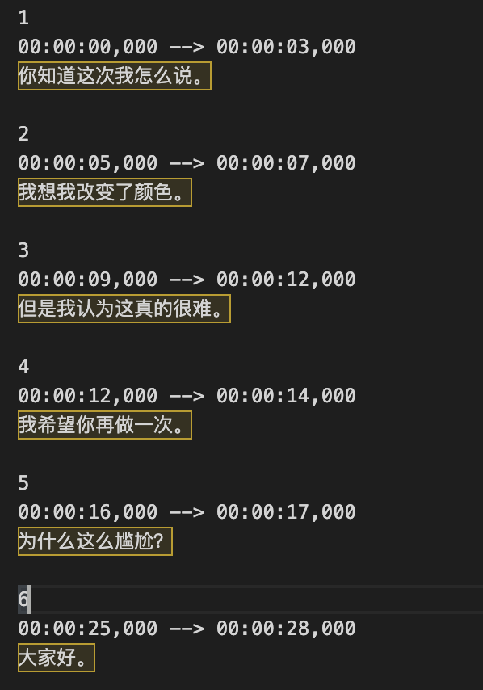

## [English Doc](english_doc.md)
# subtitles_translator 自动生成字幕、翻译字幕、添加字幕程序 
## 该程序实现以下功能：
1. 通过whisper实现：根据video/audio文件自动检测语言并生成对应语言的字幕
2. 通过whisper实现：根据video/audio文件自动检测语言，并生成翻译后的英文字幕
3. 通过whisper+translatepy实现：根据video/audio文件自动检测语言，并生成指定翻译后语言的字幕
4. 通过whisper+translatepy+ffmpeg实现：根据video/audio自动检测语言，生成指定翻译后语言的字幕，并自动添加到video文件中

其中生成字幕文件、翻译字幕文件、添加字幕文件功能相对独立，使用者可以先自己生成需要的字幕文件，修改后再通过程序添加字幕到视频中

## 下载安装    
python版本需要>=3.9  

1. `git clone git@github.com:viking-man/subtitles_translator.git`
2. `cd subtitles_translator`
3. `pip install .`
4. `brew install ffmpeg`  需要自己安装ffmpeg，通过pip安装的话，与whisper使用的ffmpeg-python有冲突

windows系统命令与上面差不多，第三步直接使用`python setup.py install`命令安装即可；ffmpeg需要自己安装
   
## 常用命令
- 生成对应语言的字幕文件，生成的字幕文件放到与video文件同一目录下

  `subtitle -t /your/video/file/path/file.mp4`

- 生成字幕文件并翻译成指定语言，默认翻译成中文，注意！！因为使用了Google翻译，国内如果没有vpn的话，无法使用翻译功能，只能生成英文字幕。并且需要在命令行指定`--China`避免调用Google服务。

  国外或者有VPN：
  `subtitle -tl /your/video/file/path/file.mp4 --target-lang "zh"`

  国内：
  `subtitle -tl /your/video/file/path/file.mp4 --China`

- 生成字幕文件并翻译成指定语言，自动生成一个包含已翻译字幕文件的视频，通过以下命令会新生成两个文件：

  
  1.翻译后的字幕文件
  2.添加了字幕的视频文件
  3.原视频文件保留不变

  国外：
  `subtitle -u /your/video/file/path/file.mp4` 默认翻译成中文，需要指定对应语言添加 `--target-lang "your language"`

  国内：
  `subtitle -u /your/video/file/path/file.mp4 --China` 翻译成英文，并自动添加到视频中

- 添加指定的字幕文件到视频中，此功能可以由ffmpeg单独完成，程序也只是调用了ffmpeg的方法
  
  `subtitle -a /your/video/file/path/file.mp4 --target-subtitles "your subtitle file path"`

- 生成视频对应语言的字幕文件，并添加字幕到视频中，不包含翻译功能

  `subtitle -ut /your/video/file/path/file.mp4`
  

## 其他可选参数  

| 参数 | 作用 | 示例 |
|--------|--------|--------|
|  --output-dir  | 指定文件输出路径，默认为源视频文件的相同目录  | --outputDir /Users/your_name/xx/xx/xx   |
| --outputs  | 指定输出文件名称，需要与inputs一一对应，默认名称“源文件名称”+“_subtitles”+源文件格式   | --outputs xxxx.mp4   |
| --lang  | 源文件的用的语言，默认会自动检测   | --lang “Korean”   |
| --target-lang  | 想要翻译成的语言，默认为'zh'，翻译成中文   | --target-lang "Japanese"   |
| --whisper-model  | whisper的模型类型，默认为small，翻译效果一般，有足够的内存和网速，可以选择medium或者large   | --whisper-model medium   |
| --device  | 代码运行的显卡类型，默认使用cuda，没有的话使用cpu   | --device cuda   |

## 效果展示
1. 生成的.srt字幕文件

   

2. 视频样例1:韩语->汉语字幕自动添加
   

3. 视频样例2:英语->汉语字幕自动添加
   

